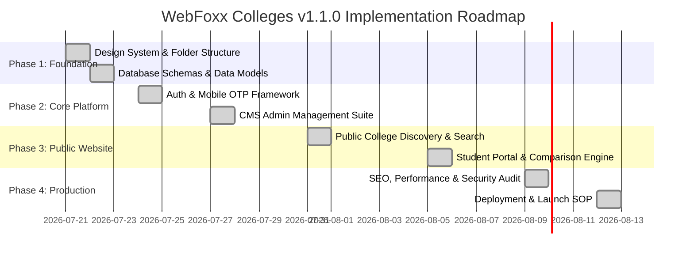

# 🚀 WebFoxx Colleges v1.1.0 — Development Plan

> **Tagline:** *Find Colleges. Not Spam.*  
> **Target Domain:** `colleges.webfoxx.com`  
> **Platform Version:** 1.1.0  

This development plan synthesizes the 18 chapters of the **WebFoxx Colleges v1.1.0 Development Cycle Blueprint** into structured, sequential implementation phases.

---

## 📅 Phased Execution Roadmap

---

## 🛠️ Phase 1: Project Setup & Design System Infrastructure (Chapters 1, 6)
**Goal:** Establish directory architecture, CSS tokens, and component primitives using brand aesthetics.

- [x] **1.1 Directory Tree Setup**
  - Created standard modular directory layout (`src/app`, `src/components`, `src/db`, `src/lib`, `src/services`, `src/styles`, `src/types`).
- [x] **1.2 Design System Tokens (`tokens.css` & `globals.css`)**
  - Primary Font: **Plus Jakarta Sans**
  - Secondary Font: **Lato**
  - Brand Palette: WebFoxx Blue (`#2563EB`), Midnight Navy (`#0F172A`), Light Gray (`#F8FAFC`), Border Gray (`#E2E8F0`).
  - Semantic Colors: Success (`#16A34A`), Warning (`#F59E0B`), Error (`#DC2626`).
- [x] **1.3 Header & Footer Navigation Primitives**
  - Brand logo with tagline "Find Colleges. Not Spam.", responsive mobile menu, and zero-spam footer.

---

## 🗄️ Phase 2: Database Architecture & Core Data Layer (Chapter 4)
**Goal:** Define relational data models for colleges, courses, placements, rankings, admissions, and users.

- [x] **2.1 Entity Schema Definitions (`src/db/schema/`)**
  - Created `college.schema.ts`, `university.schema.ts`, `course.schema.ts`, `placement.schema.ts`, `ranking.schema.ts`, `exam.schema.ts`, `scholarship.schema.ts`, `user.schema.ts`.
- [x] **2.2 Data Seeding (`src/db/seeds/colleges.seed.ts`)**
  - Seeded realistic Indian institutions (IIT Bombay, IIM Ahmedabad, BITS Pilani) with courses, placement stats, and rankings.
- [x] **2.3 Service Abstraction Layer (`src/services/college.service.ts`)**
  - Integrated search, filtering, college detail lookup, and side-by-side comparison helpers.

---

## 🔑 Phase 3: Mobile OTP & Authentication Framework (Chapter 8)
**Goal:** Implement a mobile-first login experience with high conversion and zero spam guarantee.

- [x] **3.1 Mobile OTP API Endpoints (`src/app/api/v1/auth/`)**
  - Implemented `/api/v1/auth/send-otp` & `/api/v1/auth/verify-otp`.
- [x] **3.2 Mobile OTP UI Flow (`/login`)**
  - Built 2-step OTP request and verification form with zero spam pledge.

---

## 🎛️ Phase 4: CMS Admin Management Suite (Chapter 5)
**Goal:** Build back-office CMS tools for verified data entry and management.

- [x] **4.1 CMS Dashboard (`/cms/dashboard`)**
  - Executive dashboard with metric cards, admin badges, and management navigation links.
- [x] **4.2 CMS College Manager (`/cms/colleges`)**
  - Interactive table of verified colleges with slug indicators and "+ Add New College" creation modal.

---

## 🔍 Phase 5: Public Website & College Discovery Experience (Chapter 7, 10)
**Goal:** Deliver a spam-free, responsive, fast discovery interface for students and parents.

- [x] **5.1 Homepage (`/`)**
  - Hero search bar, zero-spam value proposition cards, popular stream chips, and featured colleges.
- [x] **5.2 Global Search & Advanced Filters (`/search`)**
  - Interactive multi-faceted search page filtering by state, ownership, and search terms.
- [x] **5.3 College Detail Portal (`/colleges/[slug]`)**
  - Tabbed detail view (Overview, Courses & Fees, Placements, Rankings) with direct PDF Brochure download modal.

---

## ⚡ Phase 6: Student Portal & Interactive Discovery Tools (Chapter 9 & 7.7)
**Goal:** Provide decision-support utilities without intrusive marketing sales calls.

- [x] **6.1 College Comparison Engine (`/compare`)**
  - Side-by-side matrix comparing up to 4 colleges across ownership, fees, placements, and ratings.
- [x] **6.2 Student Dashboard (`/student/dashboard`)**
  - Student overview for saved colleges, saved comparisons, and downloaded brochures.

---

## 🛡️ Phase 7: SEO, Performance, Security & Production Build (Chapters 11–17)
**Goal:** Optimize web vitals, enforce security compliance, and execute production release.

- [x] **7.1 SEO JSON-LD & Metadata (`src/lib/seo.ts`)**
  - Created `generateCollegeJsonLd` (`EducationalOrganization`) & `generateCourseJsonLd` (`EducationalOccupationalProgram`).
- [x] **7.2 Dynamic Sitemap & Robots.txt (`src/app/sitemap.ts` & `src/app/robots.ts`)**
  - Dynamic `/sitemap.xml` listing all pages & colleges, plus `/robots.txt` disallowing private `/cms/` & `/api/` paths.
- [x] **7.3 Next.js Production Build Validation**
  - Successfully generated 15 static & dynamic optimized production routes (`npm run build`).

---

## 📊 Summary Matrix of Key Deliverables

| Phase | Core Focus | Major Deliverables | Status |
| ----- | ---------- | ------------------ | ------ |
| **Phase 1** | Foundation & Tokens | Design System, CSS Tokens, Header/Footer | ✅ Complete |
| **Phase 2** | Data Layer | Database Schemas, Seeds, Service Layer | ✅ Complete |
| **Phase 3** | Authentication | Mobile OTP API & Login Page | ✅ Complete |
| **Phase 4** | CMS Suite | Executive Dashboard & College Manager | ✅ Complete |
| **Phase 5** | Public Discovery | Homepage, Global Search, College Detail Pages | ✅ Complete |
| **Phase 6** | Student Tools | Side-by-Side Comparison Engine, Student Portal | ✅ Complete |
| **Phase 7** | Launch Readiness | SEO JSON-LD, Dynamic Sitemap & Robots.txt | ✅ Build Verified |
